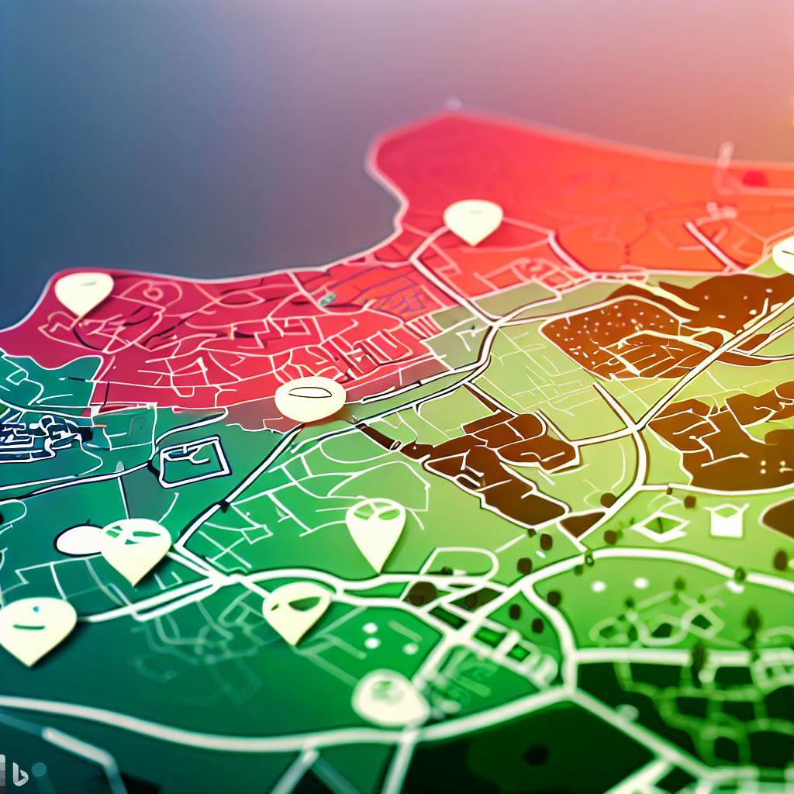

# greener grounds planning

Greener Grounds Planning is an analisys tool designed to identify and analyze areas in need of green spaces and to plan the implementation of sustainable landscaping projects. 
The tool assess the ecological impact of planting trees in specific locations. By analyzing factors such as soil type, rainfall patterns, and sunlight exposure, pollution, species of trees.  
Greener Grounds Planning ensures that all planting projects are optimized for long-term success and maximum environmental benefit.

